# TP Prédiction qualité du vin
Par Emmy Jaymes & Anaïs Dilvy
 
## Description du projet
 
   Nous allons prédire la qualité du vin en fonction des différents paramètres d'entrée que nous pouvons voir ci-dessous.
 
--  Description du jeu de donnée : Wines.csv :
 
Input variables (based on physicochemical tests):
- fixed acidity | Acidité fixe : il s'agit de l'acidité naturelle du raisin comme l'acide malique ou l'acide tartrique.
- volatile acidity | Acidité volatile : l'acidité volatile d'un vin est constituée par la partie des acides gras comme l'acide acétique appartenant à la série des acides qui se trouvent dans le vin soit à l'état libre, soit à l'état salifié. L'acidité volatile donne au vin du bouquet.
- citric acid | Acide citrique : utilisé pour la prévention de la casse ferrique et participe au rééquilibrage de l'acidité des vins.
- residual sugar | Sucre résiduel : sucres (glucose + fructose) encore présents dans le vin après fermentation.
- chlorides | Chlorures : matière minérale contenue naturellement dans le vin (sel, magnésium...)
- free sulfur dioxide | Sulfites libres : exacerbent les propriétés antioxydantes du vin
- total sulfur dioxide | Sulfites libres + Sulfites liées à la réaction avec d'autres molécules du vin
- density | Densité du vin (g/l)
- pH | PH du vin
- sulphates | Sulfates : sels composés d'anions SO4(2-) != sulfites
- alcohol | degré d'alcool
 
Output variable (based on sensory data):
- quality | Qualité générale : note comprise en 0 et 10
 
## Choix de l'analyse du modèle
 
Concernant l'analyse du jeu de donnée, nous avons fait plusieurs étapes tels qu':
 
- Afficher les informations des différentes colonnes.
 
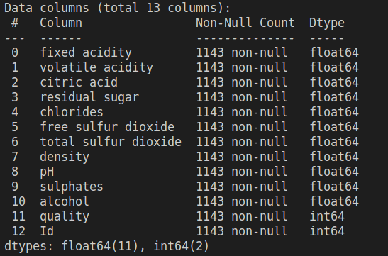
 
- Supprimer la colonne "Id", qui n'est pas utile pour prédire des données. Elle ne donne pas d'information importante
 
- Vérifier les valeurs nulles dans le jeu de données, mais après vérification nous n’en avons aucune.
 
- Regarder la corrélation entre les différentes variables. Nous analyserons toutes les colonnes sauf celle de la qualité du vin. Nous pouvons voir sur la photo ci-dessous, qu'il y a peu de corrélation entre les différentes variables. Mais nous pouvons quand même voir que entre pH et Fixed acidity nous avons -0.69 de corrélation et 0.68 pour Density et Fixed acidity. Nous réglerons ce problème en enlevant le variable Fixed acidity.
 
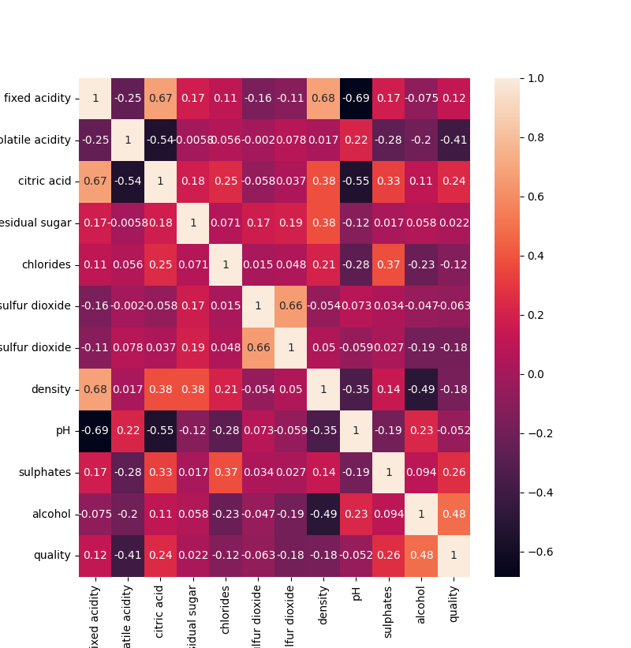
 
- Regarder les attributs des colonnes.
 
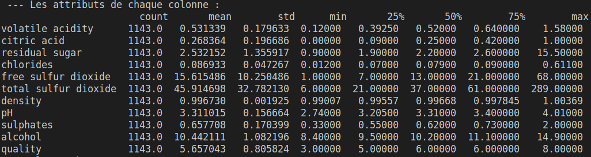
 
- Vérifier les valeurs aberrantes de toutes les variables. Voici ci- dessous un exemple pour les chlorides.
 
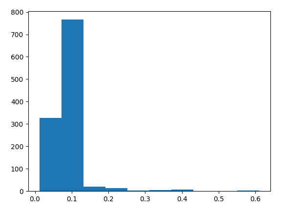
 
Nous remarquons les valeurs qui ne sont pas énormement aberrantes. Mais si nous regardons de plus près, nous en trouvons quelque uns quand même pour :
   * les chlorides nous supprimons les valeurs au-dessus 0.6,
   * le total sulfur dioxide nous supprimons les valeurs au-dessus en 250,
   * les sulphates nous supprimons les valeurs au-dessus 1.75.
 
- Vérifier la distribution des classes. En effet, nous avons beaucoup trop de données pour obtenir une qualité de 6 et 5 sur 10. Mais aucune donnée pour 1, 2, 9 et 10/10. Mais cela peut être dû au fait qu'il est très compliqué d'avoir des vins parfaits ou médiocres.
 
- Regarder la significativité des variables. Nous avons utilisé la technique du AIC. Cette étape est longue puisque nous calculons toutes les combinaisons possibles pour au final trouver le AIC le plus petit. Nous enlèverons au final citric acid et residual sugar.
 
### Choix du modèle
 
Nous choisissons d'utiliser la technique du machine learning puisqu'il est plus efficace, avec notre jeu de données. En effet, l'autre technique qui est le deep learning, permet de traiter des données non structurées : des images, du son, du texte... Ici ce n'est pas notre cas.
 
De plus, comme toutes les variables sont bien étiquetées, nous utiliserons les différentes méthodes du "supervised learning".
 
Nous avons essayé différentes techniques comme le random Forest (accuracy de 0.65 à 0.73%), ridge (accuracy de 0.59%), régression linéaire (accuracy de 0.58%), neighbors (accuracy de 0.5%)...
 
Après étude de l'accuracy des différents modèles nous décidons de choisir l'entraînement de modèle fait avec Random Forest.
 
Voici ci-dessous un image des différents accuracy que nous avons obtenu avec Random Forest :
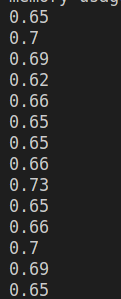
 
Dans cette étape, nous avons regardé l'importance de toutes les variables. Nous remarquons que nous n'avons pas de variable qui se démarque et qui n'est pas utile.
 
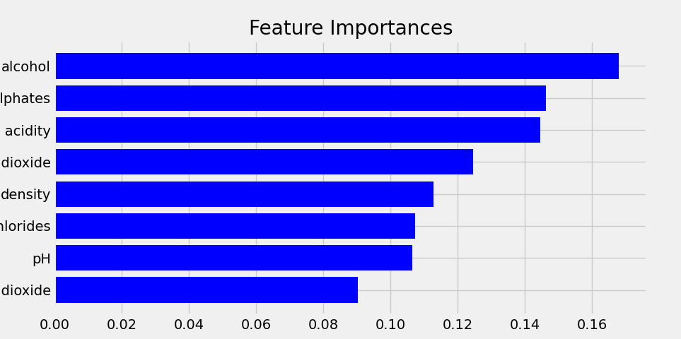
 
## Choix des paramètres du modèle
 
Nous avons essayé de changer les valeurs tels que n_estimator, ramdom_state, max_depth... Mais cela baissé ou ne changé pas l'accuracy, nous avons donc laissé, après plusieurs tests les paramètres par défaut.
 
Nous avons juste décidé de séparer le jeu d'entraînement et de test à 85% pour l'entraînement et 15% pour le test.
 
## Choix du meilleur vin
 
Nous avons décidé de faire des graphiques afin de voir l'évolution des différentes variables sur la qualité. Pour commencer nous avons fait un nuage de points.
 
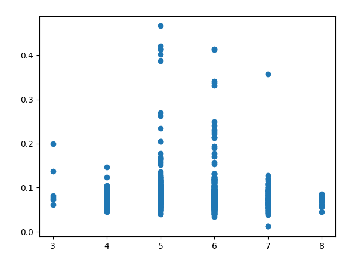
 
Après analyse de ce graphique, nous avons eu l'idée de calculer la moyenne pour chaque catégorie, par exemple calculer la moyenne pour les chlorides pour ceux ayant la quality 3, puis 4... Malheureusement l'analyse qui sera faite, ne sera pas précise puisqu'il manque un grand nombre de données. Afin d'avoir des résultats plus précis, il faudra en ajouter. Voici le code que nous avons réalisé :
 
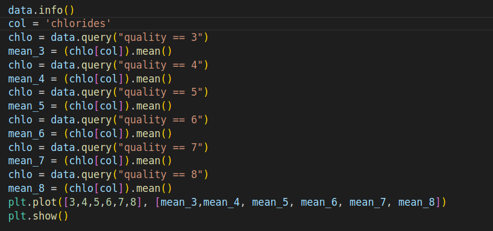
 
Et les résultats obtenus :
 
- Pour les chlorides :
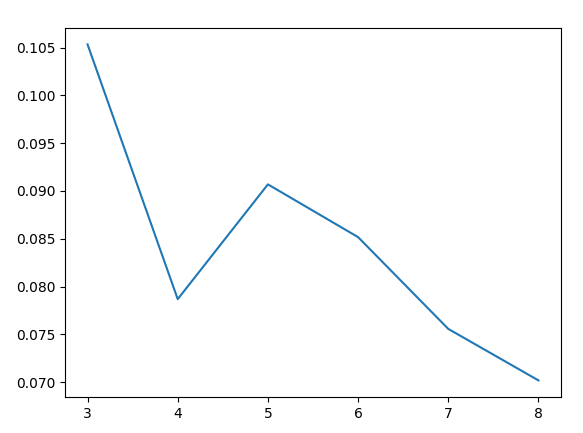
La courbe ressemble sans compter le point correspondant à une quality de 4, à une fonction linéaire décroissante. Mais la courbe pourrait aussi ressembler à une loi normale en considérant cette fois que la donnée correspondant la quality égale à 3 soit mauvaise. En effet, nous pouvons penser que les données correspondant aux valeurs 3, 4 7 et 8 peuvent être faussé par manque de données. Contrairement aux valeurs 7 et 8, qui ont plus de résultats les concernant. En conclusion, nous pouvons dire que quelque soit la courbe pour atteindre une note de 10/10, nous aurons <span style="color: #26B260">des chlorides environ égale à 0.060</span>. (Entre chaque pas nous avons un écart de 0.005.)  
 
 
- Pour volatile acidity :
  

Nous avons ici aussi plusieurs interprétations possibles. La première, est que nous avons une droite linéaire négative qui va diminuer. La deuxième est identique sauf que nous pouvons voir que la courbe à la fin va stagner. Nous allons ici choisir de partir sur l'interprétation de la deuxième méthode et au final d'obtenir <span style="color: #26B260">une volatile acidity environ égale à 0.4.</span>
 
 
- Pour free sulfur dioxide :
  

Nous voyons clairement une distribution de loi normale. Nous pouvons donc conclure que <span style="color: #26B260"> free sulfur dioxide sera environ égale à 8.</span>
 
 
- Pour total sulfur dioxide :
  

Nous pouvons dire que ce graphique ressemble aussi à une loi normale. Mais il nous manquera de la donnée, pour déterminer exactement la valeur obtenue pour une note de 10/10. Nous pouvons quand même penser la valeur de <span style="color: #26B260"> total sulfur dioxide sera environ égale à 25 ou moins.</span>
 
 
- Pour density :
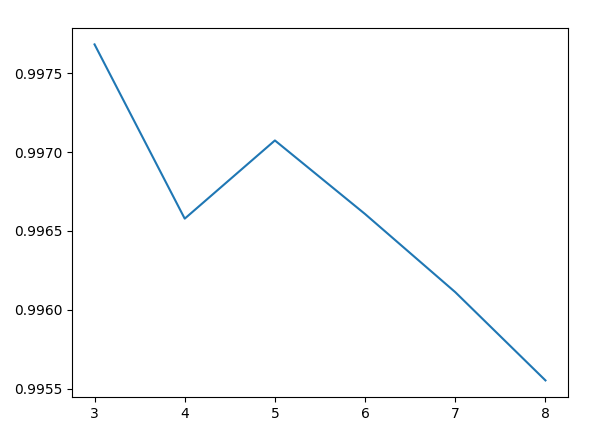  

Nous avons à peu près le même graphique que le premier sur les chlorides. L'interprétation est donc la même. Nous pouvons donc dire que <span style="color: #26B260"> la density sera environ égale à 0.9945.</span>
 
 
- Pour pH :
  

Cette courbe est sous forme d'escalier. Mais il nous manque beaucoup de données pour ce graphique pour déterminer la vraie valeur du vin parfait. Nous pouvons donc dire que <span style="color: #26B260"> le pH sera environ égale à 3.32.</span>
 
 
- Pour les sulphates :
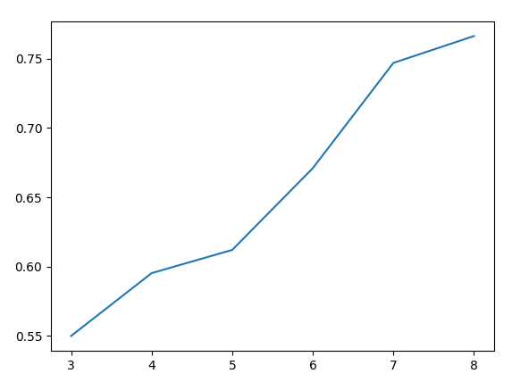  

Nous pouvons voir une courbe linéaire positive. Nous pouvons donc dire que <span style="color: #26B260"> les sulphates sera environ égale à 0.85.</span>
 
 
- Pour l'alcohol :
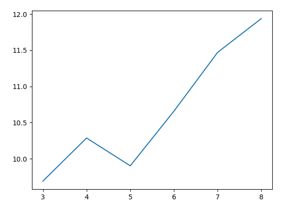  

Nous pouvons voir que ce graphique ressemble aussi au premier étudié mais dans l'autre sens. Nous avons donc deux cas d'interprétations possibles. Nous partons donc sur la droite linéaire positive et donc dire que <span style="color: #26B260"> l'alcohol sera environ égale à 13.0.</span>
 
 
- Pour citric acid :
  

Nous pouvons donc dire que nous avons une courbe linéaire positive. Nous pouvons donc dire que <span style="color: #26B260"> citric acid sera environ égale à 0.5.</span>
 
 
- Pour fixed acidity :
  

Nous avons un graphique peu clair pour l'interprétation. Nous pouvons dire qu'il s'agit malgré des erreurs d'une droite linéaire positive. Nous pouvons donc dire que <span style="color: #26B260"> fixed acidity sera environ égale à 9.4.</span>
 
 
- Pour residual sugar :
  

L'interprétation est complexe aussi sur ce graphique. Mais nous pouvons dire que cela ressemble à une loi normale. Nous pouvons donc dire que <span style="color: #26B260"> residual sugar sera environ égale à 2.66.</span>
 
## Installation
 
### Ubuntu
Ouvrir un terminal Ctrl+T. Puis cloner le repertoire:
```
git clone git@github.com:dilvy-anais/wine-quality-prediction.git
```
Créer un environnement virtuel et activer-le:
```
cd wine-quality-prediction
python3 -m venv venv
source venv/bin/activate
```
Installer les dépendences : 
```
pip install -r requirements.txt
```
Lancer le programme: 
```
uvicorn main::app --reload
```

Pour le tester l'API, il faut aller sur l'url http://127.0.0.1/api/docs.

NB: Au démarrage le model préentrainé est chargé en mémoire. Pour obtenir son accuracy il faudra le réentrainer.

 
 
 
 

